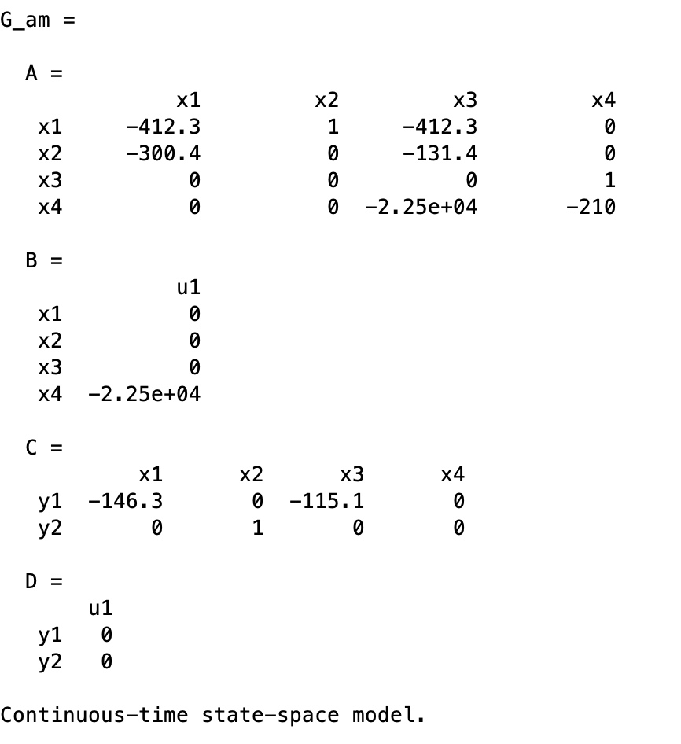
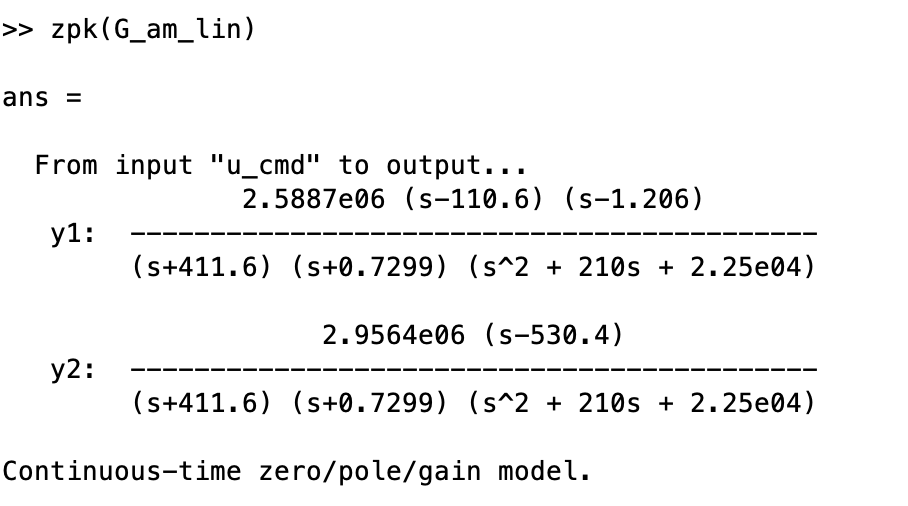
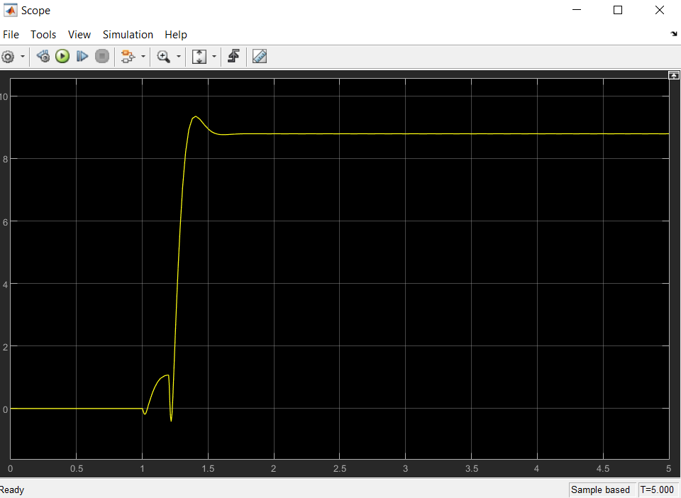
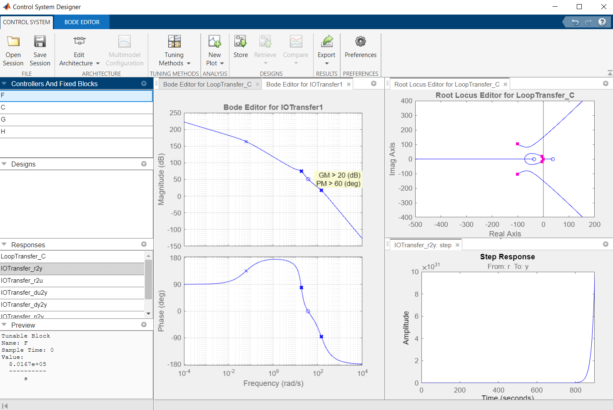

# BE Commande Robuste Emilien Reuillard et Antonin Renoir

## 1. Systemmodeling(20%)
### Question 1.1: Flight dynamics (10%)

Nous allons discuter du modèle linéaire nominal sans incertitude de l'espace d'état de la dynamique de tangage du missile. 
En effet le modèle du missile donné dans l'enoncé est purrement linéaire car il ne comporte pas de composantes non linéaires comme des termes au carré ou alors des fonctions non linéaire comme des cosinus ou des sinus (fonctions souvent présentes dans les systèmes non linéaires lorsque des angles interviennent)
Plusieurs étapes sont néccéssaires pour obtenir le modèle linéaire à partir du modèle non-linéaire. 
La première étape est la formulation des équations de la dynamique de tangage du missile : Les équations de la dynamique de tangage du missile sont des équations différentielles non linéaires qui décrivent l'évolution de l'angle de tangage, de la vitesse angulaire et d'autres variables liées au mouvement du missile. Ces équations peuvent être obtenues à partir des lois de la physique et de la dynamique du missile, en utilisant des modèles mathématiques appropriés. 
Nous les avons vu dans le cours et il n'est pas intérréssant de les rappeler dans ce rapport. 
La deuxième étape est la linéarisation de ces équations. Pour cela il est judicieux de savoir quels thermes linéarisé ainsi que le point d'équilibre autour duquel il faut linéarisé. En effet le linéarisation d'une fonction non-linéaire se fait toujours au voisinage d'un point d'équilibre. La linéarisation le plus connu dans ce cas concerne les fonctions trigonométrique cosinus(alpha) et sinus(alpha) qui se linéarise respectivement en 1 et alpha lorsque alpha est proche (voisinage) de zéro (point d'équilibre).
Pour le cas du missile cela est un peu plus compiqué. 

Calcul du (ou des) point(s) d'équilibre : en général dans un système non linéaire les points d'équilibres se calculs de la mnière suivante. 
Soit un système non linéaire représenté sous forme de représentation d'état non linéaire (les matrices sont des fonction avec en paramètre le vecteur d'état) alors un point d'équibre (valeur particulière du vecteur d'état) est un point pour lequel la dérivé du vecteur d'état est nul. 
Soit par example ([x1, x2] vecteur d'état) x1_dot = f_1(x1,x2) = 0 et x2_dot = f_2(x1,x2) = 0

Dans un premier temps il faut traiter de **l'enveloppe de vol**. Effet d'apres le texte de Reichert, 1992 [1], il faut que l'angle d'attaque soit compris entre -20° et 20° de manière a assurer la stabilité robuste du système bouclé et assurer la poursuite d'un signal d'entré de type échelon. Cela nous permet donc de savoir ou linéariser les équations fournis dans le cours. Alpha autour de ces deux extremums. Ensuite pour linéariser nous utilisons la décomposition en série de Taylor qui permet de décomposoer les composantes non linéaires suivnt plusieurs degrées. Ainsi le premier terme peut être gardé pour apliquer la linéarisation. 

Sous Matlab /Simulmink : 
- La fonction linmod() : cette fonction permet de générer automatiquement une représentation linéaire d'un modèle Simulink.
- La commande linearize() : cette commande permet de linéariser un modèle Simulink ou une fonction Matlab en utilisant la méthode de la réponse fréquentielle linéaire. Nous utiliserons cette fonction par la suite. 
- La commande ss peut aussi servir à linéariser en créant le modèle d'état. 

### Question 1.2: Model construction & analysis (10%)
Pour obtenir G_am nous avons changer la matrice C dans la representation d'état de l'Actuator pour ne visualiser que x3. Ainsi la representation d'état de G_am est : 

Nous avons créé le schéma sous simulink : Voir **Airframe.slx**

Les formes zpk du système de u_cmd à y1, y2 respectivement sont (par exemple G_am_nz, G_am_q) sont : 

Voici les pôles et les zéros d'entrée / sortie avec la fonction isomap : 
.png)
Pour la sortie y1 nous avons 4 pôles et 2 zéros. Alors que pour y2 comme sortie nous avons 4 pôles et 1 zéro. 
Les composantes instables sont celles avec des parties réels positives. 

## 2. Loopshaping(20%)
### Question 2.1: Damping gain design (5%)

En se basant sur le ficgure numéro 3 on cherche le gain C_q tel que l'amortissement soit optimisé (0.7). Poour cela on utilise rlocus qui trace la position des pôle du système en faisant varier le gain c_q de 0 à l'infini. 
On obtient les figures ci-après. 
.png)
En zommant on voit que on peut placer le curser pour voir quel gain correspond à l'ammortissemnt de 0.7 : 
_zoom.png)
(Cependant avec le precision du graphique nous n'avojs pas réussi à nous placer au proche de 0.7). Donc nous avons estimé le gain souhaité égale à -0.16.

Avec rlocus la courbe du haut nous fourni aussi une valeur de C_q pour un amortissement de 0.7 mais ce gain est compris en 0 et 0.041. Ainsi il nous a parru plus judicieux de choisir les courbes prochent de l'axe des abscisses pour rlocus.  

Ensuite nous pouvons comparer les resultat obtenu avec la figure 3 reproduite : 
- zpk(G_am(1,1)):
.png)
- zpk(G_cl_q_unsc) :
.png)

Les zeros sont triviaux à trouver et les pôles peuvent être donnés avec la fonction *pole*. 

).png)
.png)

### Question 2.2: Scaling gain design (5%)
On récurpère l'inverse du gain C_sc avec la foncion dcgain sur G_cl_q_unsc. On le nomme C_sc_inv que l'on inverse pour avoir C_sc. 

On implemente le gain C_q et C_sc dans Simulink. Et on récupère *G* le système linéarisé qui prend en compte les deux gains précedants. On va alors vérifier la convergence de G : 

.png)

On constate bien une convergence vers 1 en réponse au step. De plus le missile effectue une baisse dans la trajectoire du à la présence de zéros. Le temps de réponse est affiché et est 0.3. 

On a ajouté une pertubation sur y2 avec un step à 1.2 secondes. Voila le résultat : 

Ce que l'on peut voir c'est que la pertubation n'est pas rejetée par le système. En effet on voir bien la réponse de la figure *stee(G)* mais quand la pertubation survient la valeut final atteint 9. Ce n'est pas intérréssant et la question suivante va nous permettre de compenser cette pertubation. 

### Question 2.3: Integral gain design (10%)

Nous cherchons C_i. Pour cela nous utilisons sisotool qui va nous permettre de touver les gains adéquiates en changeant la marge de phase de manière manuelle. 

Selon notre modèle, C_i est compris dans F. Nous considérons une valeur de C_i =1 pour trouver le reste. Nous allons donc modifier F pour modifier la valeur voulue de C_i. Mais nous sommes obligé de modifier aussi la variable C de sisotools de façon à obtenir une Marge de Phase de 60°.
Nous modifions donc C puis F. Voir capture : 

on peut voir que là où la courbe de gain coupe 0 on à une marge de phase de 60 degrès sur la courbe de phase. Cela convient au cahier des charges. 

Avec cette méthode nous avons trouvé une valeur de F qui nous convient puis nous avons eu C_i en divisant F par C_sc. Aisni nous avons F = 8.0167e+05 et donc C_i = 3,942e+7. 

## 3.	Mixed sensitivity design (60%)
### A.	Weighting filters (5%)
#### Question 3A.1: Weighting filter discussion (2.5%)

Dans le contexte de la commande de système par commande robuste, un filtre de pondération est un outil de conception qui permet de spécifier des poids pour différentes fréquences du signal de référence et du signal de perturbation. Ces poids sont ensuite utilisés pour pondérer les performances du système dans ces différentes fréquences lors de la conception du régulateur.

Par exemple, dans un système de contrôle de vitesse de moteur, les basses fréquences peuvent être plus importantes que les hautes fréquences, car les variations de vitesse à basse fréquence peuvent affecter la stabilité du système.

Autre exemple, si le système est soumis à des perturbations à haute fréquence, le filtre de pondération peut être utilisé pour réduire la sensibilité du système à ces perturbations.

W1 est pour la sortie et W2 est pour le control. 
On sait que : 
 - en basse fréquence il n'y a pas de bruit.
 - en hautes fréquences il n'y a pas de pertubations. 

De plus avec ce qui est décrit slide 12 du cours on a ainsi W1 doit être un filtre passe haut et W2 doit être un filtre passe bas. 

#### Question 3A.2: Weighting filter computation (2.5%)

Pour determiner les deux filtres on utilise la fonction makeweight qui nous permet de modéliser un filtre grâce à ses paramètres. Grâce aux informations donnés dans l'énoncé on peut determiner les paramètres pour chaque filtre et les créer ensuite. 

On décide ensuite determiner M_1, W_1, A_1. On utilise les équiations du sujet qui correspondent à w_1 et w_2 puis grâce à la forme de zpk(w_1) on trouve par comparaison les 3 valeurs recherché. On fait de même avec M_2 grâce à zpk(w_2). 

### B. Reference model (5%)
#### Question 3B.1: Reference model computation (5%)

A faire lundi. 

### %% C.	Feedback controller design (hinfsyn) (20%)
#### Question 3C.1: Controller design (10%)

Nous allons construite un controller de rejet/suivi de perturbation. 

On met en forme P et Twz suivant le sujet. Pour S0 on applique la formule donné dans le sujet. De même pour les autres composantes de cette question. 

## Sources 
[1] : R. T. Reichert, “Dynamic scheduling of modern-robust-control autopilot designs for missi- les”, IEEE Control Systems, vol. 12, no. 5, pp. 35–42, 1992.
